# Thiết kế cơ sở dữ liệu

> Tài liệu thiết kế dữ liệu cho hệ thống giám sát & quản lý kho lạnh, dựa trên các entity/schema thực tế trong `server/src/`.

---

## 1. Tổng quan kiến trúc dữ liệu

Hệ thống dùng 3 datastore, mỗi loại dữ liệu đặt ở nơi phù hợp nhất với đặc tính truy cập của nó:

| Datastore | Vai trò | Dữ liệu lưu trữ |
|---|---|---|
| MySQL | Nguồn dữ liệu quan hệ chính, có migration, toàn vẹn tham chiếu (FK, unique, check constraint) | Người dùng, phân quyền theo kho, kho lạnh, danh mục sản phẩm, lô hàng, ca trực, thiết bị IoT, lệnh điều khiển, cảnh báo, thông báo, nhật ký hệ thống |
| MongoDB | Dữ liệu telemetry tần suất cao, dạng time-series, không cần toàn vẹn tham chiếu | Mẫu telemetry thô (`telemetry_raw`), dữ liệu tổng hợp theo giờ (`telemetry_hourly`) |
| Redis | Trạng thái phiên đăng nhập và hàng đợi xử lý nền | Refresh token đang hoạt động, hàng đợi BullMQ |

`deviceId`/`coldRoomId` trong MongoDB chỉ là chuỗi trỏ về id của bản ghi MySQL tương ứng — không có toàn vẹn tham chiếu giữa hai datastore; việc chuẩn hoá thiết bị/phòng lạnh bị xoá không tự động dọn dữ liệu telemetry liên quan.

---

## 2. MySQL — sơ đồ quan hệ tổng thể

```mermaid
erDiagram
  USERS ||--o{ WAREHOUSE_STAFF : assigned_via
  WAREHOUSES ||--o{ WAREHOUSE_STAFF : has
  WAREHOUSES ||--o{ COLD_ROOMS : contains
  WAREHOUSES ||--o{ WORK_SHIFTS : scheduled_at
  COLD_ROOMS ||--o{ DEVICES : hosts
  COLD_ROOMS ||--o{ BATCHES : stores
  COLD_ROOMS ||--o{ ALERTS : scoped_to
  PRODUCT_TYPES ||--o{ BATCHES : classifies
  SHIFTS ||--o{ WORK_SHIFTS : template_for
  USERS ||--o{ WORK_SHIFTS : works
  DEVICES ||--o{ DEVICE_CHANNELS : has
  DEVICES ||--o{ DEVICE_STATUS_HISTORY : has
  DEVICES ||--o{ ALERTS : triggers
  DEVICE_CHANNELS ||--o{ COMMANDS : receives
  BATCHES ||--o{ ALERTS : concerns
  USERS ||--o{ ALERTS : acknowledges_resolves
  USERS ||--o{ COMMANDS : issues
  USERS ||--o{ AUDIT_LOGS : performs
  USERS ||--o{ DEVICE_STATUS_HISTORY : changes
  USERS ||--o{ NOTIFICATIONS : receives
  USERS ||--o{ PUSH_SUBSCRIPTIONS : owns
  ALERTS ||--o{ NOTIFICATIONS : generates
  WAREHOUSES ||--o{ AUDIT_LOGS : scoped_to

  USERS {
    varchar36 id PK
    varchar username UK
    varchar email UK
    varchar phone
    varchar password_hash
    varchar full_name
    json image_urls
    enum role "admin | manager | staff | technician"
    enum status "active | locked"
    timestamp password_changed_at
    timestamp last_login_at
    timestamp deleted_at
  }
  WAREHOUSES {
    varchar36 id PK
    varchar name UK
    varchar code UK
    varchar address
    json image_urls
    timestamp deleted_at
  }
  WAREHOUSE_STAFF {
    varchar36 user_id PK
    varchar36 warehouse_id PK
    timestamp created_at
  }
  COLD_ROOMS {
    varchar36 id PK
    varchar36 warehouse_id FK
    varchar name
    decimal temp_min
    decimal temp_max
    decimal hysteresis
    int door_open_max_seconds
    int capacity_pallets
    decimal capacity_weight_kg
    decimal capacity_volume_m3
    timestamp deleted_at
  }
  PRODUCT_TYPES {
    varchar36 id PK
    varchar name UK
    varchar category
    enum unit "kg | liter | piece | box"
    json image_urls
    decimal storage_temp_min
    decimal storage_temp_max
    timestamp deleted_at
  }
  BATCHES {
    varchar36 id PK
    varchar36 cold_room_id FK
    varchar36 product_type_id FK
    varchar batch_code
    decimal quantity
    varchar supplier
    date received_at
    date expiry_date
    date removed_at
    enum status "in_stock | expired | removed"
    text notes
  }
  SHIFTS {
    varchar36 id PK
    varchar100 name
    time start_time
    time end_time
    timestamp deleted_at
  }
  WORK_SHIFTS {
    varchar36 id PK
    varchar36 shift_id FK
    varchar36 staff_id FK
    varchar36 warehouse_id FK
    date work_date
    timestamp scheduled_start_at
    timestamp scheduled_end_at
    enum status "pending | approved | rejected | expired"
    timestamp check_in_at
    timestamp check_out_at
    varchar36 reviewed_by FK
    timestamp reviewed_at
    varchar255 reject_reason
  }
  DEVICES {
    varchar36 id PK
    varchar unique_id UK
    varchar36 cold_room_id FK "nullable — null trước khi claim"
    varchar firmware_version
    enum status "registered | provisioned | active | offline | fault | maintenance | decommissioned"
    timestamp last_heartbeat_at
    varchar claim_code_hash
    timestamp claim_code_expires_at
    timestamp claimed_at
    timestamp decommissioned_at
    timestamp deleted_at
  }
  DEVICE_CHANNELS {
    varchar36 id PK
    varchar36 device_id FK
    enum channel_type "limit_switch | temp_humidity_sensor | current_sensor | fan_motor | indicator_light | buzzer"
    enum channel_role "sensor | actuator"
    varchar label
  }
  COMMANDS {
    varchar36 id PK
    varchar36 channel_id FK
    varchar36 issued_by FK "nullable — null nếu tự động"
    enum action "on | off"
    json payload
    enum status "pending | sent | done | failed"
    timestamp ack_at
  }
  DEVICE_STATUS_HISTORY {
    varchar36 id PK
    varchar36 device_id FK
    enum old_status "nullable"
    enum new_status
    varchar36 changed_by FK "nullable"
    enum trigger "manual | automated"
    varchar reason
    timestamp changed_at
  }
  ALERTS {
    varchar36 id PK
    varchar36 cold_room_id FK
    varchar36 device_id FK "nullable — đúng 1 trong 2 với batch_id"
    varchar36 batch_id FK "nullable"
    enum type "temperature_out_of_range | temperature_predicted | device_fault | offline | door_open_too_long | batch_temperature_out_of_range | batch_expiring_soon"
    enum status "open | acknowledged | resolved"
    varchar active_key UK "nullable, chỉ có giá trị khi đang mở"
    decimal trigger_value
    decimal threshold
    json details
    varchar36 acknowledged_by FK "nullable"
    timestamp acknowledged_at
    varchar36 resolved_by FK "nullable"
    timestamp resolved_at
    enum resolution "auto | manual, nullable"
  }
  NOTIFICATIONS {
    varchar36 id PK
    varchar36 user_id FK
    varchar36 alert_id FK "nullable"
    varchar title
    text body
    enum status "pending | sent | failed"
    timestamp sent_at
    timestamp read_at
  }
  PUSH_SUBSCRIPTIONS {
    varchar36 id PK
    varchar36 user_id FK
    varchar512 endpoint UK
    varchar p256dh_key
    varchar auth_key
    varchar user_agent
    timestamp last_used_at
  }
  AUDIT_LOGS {
    varchar36 id PK
    varchar36 user_id FK
    varchar36 warehouse_id FK "nullable"
    varchar action "quy ước resource.verb"
    varchar target_type "nullable"
    varchar36 target_id "nullable"
    json metadata
  }
```

---

## 3. Người dùng & phân quyền theo kho

### `users`

Tài khoản đăng nhập hệ thống. `role` là thuộc tính toàn cục, một giá trị/user (xem `docs/RBAC.md`).

| Cột | Kiểu | Ghi chú |
|---|---|---|
| `id` | `varchar(36)` PK | UUIDv7 |
| `username`, `email` | `varchar` UNIQUE | `email` nullable |
| `phone`, `full_name` | `varchar` nullable | |
| `password_hash` | `varchar` | bcrypt |
| `image_urls` | `json` nullable | mảng URL ảnh đại diện (MinIO) |
| `role` | `enum` (indexed) | `admin \| manager \| staff \| technician` |
| `status` | `enum` (indexed), default `active` | `active \| locked` — khoá tài khoản khi nhân viên nghỉ việc |
| `password_changed_at` | `timestamp`, default now | dùng để vô hiệu hoá access token cũ khi cần |
| `last_login_at` | `timestamp` nullable | |
| `deleted_at` | soft delete | |

### `warehouses`

Master data cấp hệ thống, chỉ Admin quản lý (xem `docs/RBAC.md`).

| Cột | Kiểu | Ghi chú |
|---|---|---|
| `id` | `varchar(36)` PK | |
| `name`, `code` | `varchar` UNIQUE | |
| `address` | `varchar` nullable | |
| `image_urls` | `json` nullable | |
| `deleted_at` | soft delete | |

### `warehouse_staff`

Bảng gán user vào warehouse — nguồn của "Phạm vi" trong mô hình RBAC. Không mang role: user làm việc ở mọi kho được gán với `users.role` của mình. Không có cột `id` riêng: **khoá chính composite** `(user_id, warehouse_id)`, nên một user chỉ có đúng một bản ghi gán cho mỗi warehouse.

| Cột | Kiểu | Ghi chú |
|---|---|---|
| `user_id` | `varchar(36)` PK, FK → `users.id` (CASCADE) | |
| `warehouse_id` | `varchar(36)` PK, FK → `warehouses.id` (CASCADE) | |
| `created_at` | `timestamp` | |

---

## 4. Kho lạnh & danh mục sản phẩm

### `cold_rooms`

Từng phòng lạnh trong một warehouse, mỗi phòng có ngưỡng nhiệt độ riêng.

| Cột | Kiểu | Ghi chú |
|---|---|---|
| `id` | `varchar(36)` PK | |
| `warehouse_id` | FK → `warehouses.id` | UNIQUE cùng `name` — tên phòng không trùng trong cùng 1 warehouse |
| `name` | `varchar` | |
| `temp_min`, `temp_max` | `decimal(5,2)` | ngưỡng an toàn |
| `hysteresis` | `decimal(5,2)`, default `1` | biên trễ chống bật/tắt liên tục thiết bị làm mát |
| `door_open_max_seconds` | `int`, default `15` | ngưỡng sinh cảnh báo cửa mở quá lâu |
| `capacity_pallets`, `capacity_weight_kg`, `capacity_volume_m3` | nullable | chỉ điền đơn vị sức chứa phù hợp với loại hàng phòng đó lưu |
| `deleted_at` | soft delete | |

### `product_types`

Danh mục loại sản phẩm — master data, chỉ Admin quản lý.

| Cột | Kiểu | Ghi chú |
|---|---|---|
| `id` | `varchar(36)` PK | |
| `name` | `varchar` UNIQUE | |
| `category` | `varchar` nullable | |
| `unit` | `enum` | `kg \| liter \| piece \| box` — đơn vị đo `batches.quantity` tham chiếu tới loại này |
| `image_urls` | `json` nullable | |
| `storage_temp_min`, `storage_temp_max` | `decimal(5,2)` nullable | ngưỡng nhiệt độ khuyến nghị, dùng để validate khi tạo `batch` vào 1 `cold_room` (`cold_room.temp_min/max` phải bao trùm khoảng này) |
| `deleted_at` | soft delete | |

---

## 5. Vận hành hàng hoá & ca trực

### `batches`

Lô hàng lưu trong một cold room.

| Cột | Kiểu | Ghi chú |
|---|---|---|
| `id` | `varchar(36)` PK | |
| `cold_room_id` | FK → `cold_rooms.id` | UNIQUE cùng `batch_code` |
| `product_type_id` | FK → `product_types.id` | |
| `batch_code` | `varchar` | |
| `quantity` | `decimal(10,2)` | đơn vị theo `product_type.unit`, không nhất thiết là khối lượng |
| `supplier` | `varchar` nullable | |
| `received_at`, `expiry_date` | `date` | |
| `removed_at` | `date` nullable | |
| `status` | `enum`, default `in_stock` | `in_stock \| expired \| removed` |
| `notes` | `text` nullable | |

Không có `deleted_at`: `removed_at` + `status = removed` đã đại diện cho "không còn là tồn kho hoạt động", nên không cần thêm khái niệm soft-delete riêng.

### `shifts`

Mẫu ca làm việc (tên tự đặt), không gắn với ngày hay nhân viên cụ thể — master data. Khung giờ các mẫu ca chưa xoá không chồng nhau, do `ShiftsService` kiểm tra (không có ràng buộc DB).

| Cột | Kiểu | Ghi chú |
|---|---|---|
| `id` | `varchar(36)` PK | |
| `name` | `varchar(100)` | duy nhất trong các mẫu ca chưa xoá — kiểm tra ở `ShiftsService`, không dùng unique index vì index sẽ tính cả mẫu đã xoá mềm |
| `start_time`, `end_time` | `time` | |
| `deleted_at` | soft delete | |

### `work_shifts`

Một lượt chấm công: nhân viên tự gửi yêu cầu vào một ca (mẫu ca + ngày) tại một warehouse, Manager duyệt — nguồn của điều kiện "Ca trực" trong RBAC. Ca được hệ thống chọn theo thời điểm gửi (xem `docs/API_DESIGN.md` §8).

| Cột | Kiểu | Ghi chú |
|---|---|---|
| `id` | `varchar(36)` PK | |
| `shift_id` | FK → `shifts.id` | |
| `staff_id` | FK → `users.id` | UNIQUE cùng `(work_date, shift_id)` — một nhân viên chỉ có một lượt chấm công cho một ca; gửi lại sau khi bị từ chối dùng lại chính dòng này |
| `warehouse_id` | FK → `warehouses.id` | INDEX cùng `work_date` (danh sách duyệt theo kho + ngày) |
| `work_date` | `date` | ngày bắt đầu ca (giờ Việt Nam) |
| `scheduled_start_at`, `scheduled_end_at` | `timestamp` | snapshot `work_date` + giờ của `shift` tại thời điểm gửi — sửa `shifts` sau đó không làm thay đổi bản ghi đã có |
| `status` | `enum`, default `pending` | `pending \| approved \| rejected \| expired` |
| `check_in_at` | `timestamp` nullable | thời điểm gửi yêu cầu (lần gần nhất); `NULL` chỉ ở dữ liệu cũ |
| `check_out_at` | `timestamp` nullable | khi Staff đăng xuất lúc hết ca, hoặc sweep điền (hết ca + 5 phút). `approved` + `check_out_at IS NULL` + chưa quá hết ca + 5 phút = đang trong ca trực |
| `reviewed_by` | FK → `users.id` nullable | Manager/Admin đã duyệt hoặc từ chối |
| `reviewed_at` | `timestamp` nullable | |
| `reject_reason` | `varchar(255)` nullable | lý do từ chối, hiển thị cho Staff |

Không có cascade xoá trên bất kỳ FK nào: lịch sử ca trực phải tồn tại độc lập với việc nhân viên/warehouse/mẫu ca bị xoá sau này (phục vụ đối chiếu công/audit).

---

## 6. Thiết bị IoT

### `devices`

Một node ESP32 vật lý.

| Cột | Kiểu | Ghi chú |
|---|---|---|
| `id` | `varchar(36)` PK | |
| `unique_id` | `varchar` UNIQUE | định danh phần cứng |
| `cold_room_id` | FK → `cold_rooms.id`, **nullable** | chỉ có giá trị sau khi được claim vào phòng; không cascade xoá — cold room bị soft-delete không được phá huỷ bản ghi thiết bị vật lý |
| `firmware_version` | `varchar` nullable | |
| `status` | `enum`, default `registered` | `registered → provisioned → active ⇄ offline/fault → maintenance → decommissioned` (một chiều tới `decommissioned`) |
| `last_heartbeat_at` | `timestamp` nullable | |
| `claim_code_hash` | `varchar` nullable | **chỉ lưu hash**, mã gốc chỉ trả về một lần lúc sinh, không bao giờ xuất hiện lại trong response |
| `claim_code_expires_at` | `timestamp` nullable | TTL của mã kích hoạt |
| `claimed_at`, `decommissioned_at` | `timestamp` nullable | |
| `deleted_at` | soft delete | |

### `device_channels`

Một ngoại vi (cảm biến/cơ cấu chấp hành) gắn trên một device.

| Cột | Kiểu | Ghi chú |
|---|---|---|
| `id` | `varchar(36)` PK | |
| `device_id` | FK → `devices.id` | |
| `channel_type` | `enum` | `limit_switch \| temp_humidity_sensor \| current_sensor \| fan_motor \| indicator_light \| buzzer` |
| `channel_role` | `enum` | `sensor \| actuator` — suy ra server-side từ `channel_type`, không nhận trực tiếp từ client |
| `label` | `varchar` nullable | phân biệt nhiều channel cùng loại trên 1 device (vd "fan 1", "door 2") |

Không có ràng buộc unique trên `(device_id, channel_type)`: một device được phép có nhiều channel cùng loại (vd 2 quạt).

### `commands`

Lệnh điều khiển gửi tới một channel.

| Cột | Kiểu | Ghi chú |
|---|---|---|
| `id` | `varchar(36)` PK | |
| `channel_id` | FK → `device_channels.id` | |
| `issued_by` | FK → `users.id`, nullable | `NULL` khi lệnh do rule tự động phát ra (vd cảnh báo quá nhiệt tự bật buzzer) |
| `action` | `enum` | `on \| off` |
| `payload` | `json` nullable | tham số riêng theo loại actuator (tốc độ quạt, kiểu còi...) |
| `status` | `enum`, default `pending` | `pending → sent → done \| failed` |
| `ack_at` | `timestamp` nullable | |

Không cascade xoá trên FK: lịch sử lệnh phải tồn tại độc lập với channel/user bị xoá sau này (phục vụ audit).

### `device_status_history`

Nhật ký append-only mọi lần đổi trạng thái thiết bị — nguồn duy nhất trả lời "khi nào và tại sao" (khác `devices.status` chỉ giữ giá trị hiện tại).

| Cột | Kiểu | Ghi chú |
|---|---|---|
| `id` | `varchar(36)` PK | |
| `device_id` | FK → `devices.id` | index cùng `changed_at` |
| `old_status` | `enum` nullable | `NULL` chỉ với bản ghi đầu tiên (tạo thẳng vào `registered`) |
| `new_status` | `enum` | |
| `changed_by` | FK → `users.id`, nullable | `NULL` khi `trigger = automated` |
| `trigger` | `enum` | `manual \| automated` |
| `reason` | `varchar` nullable | |
| `changed_at` | `timestamp` | |

---

## 7. Cảnh báo & thông báo

### `alerts`

Một bản ghi cho mỗi sự cố, vừa là lịch sử append-only vừa giữ trạng thái hiện tại trong cùng 1 dòng (`status` chuyển `open → acknowledged → resolved`).

| Cột | Kiểu | Ghi chú |
|---|---|---|
| `id` | `varchar(36)` PK | |
| `cold_room_id` | FK → `cold_rooms.id` | snapshot tại thời điểm phát sinh — vẫn đúng ngay cả khi thiết bị sau đó bị chuyển phòng khác; index cùng `(status, created_at)` |
| `device_id` | FK → `devices.id`, nullable | |
| `batch_id` | FK → `batches.id`, nullable | |
| `type` | `enum` | `temperature_out_of_range \| temperature_predicted \| device_fault \| offline \| door_open_too_long \| batch_temperature_out_of_range \| batch_expiring_soon` |
| `status` | `enum`, default `open` | `open \| acknowledged \| resolved` |
| `active_key` | `varchar` UNIQUE nullable | `{type}:{deviceId\|batchId}` khi đang mở/đã acknowledge, set về `NULL` khi resolve — biến "chỉ 1 alert đang hoạt động cho mỗi sự cố" thành ràng buộc DB thật (unique index bỏ qua NULL), tránh race condition kiểu check-rồi-insert |
| `trigger_value`, `threshold` | `decimal(10,2)` nullable | snapshot giá trị đo và ngưỡng tại thời điểm phát sinh, vì ngưỡng có thể đổi sau và telemetry thô không lưu vĩnh viễn |
| `details` | `json` nullable | dữ liệu đặc thù theo loại alert (hướng vượt ngưỡng, thời điểm cửa mở, id sự kiện cửa...) |
| `acknowledged_by`, `resolved_by` | FK → `users.id`, nullable | |
| `acknowledged_at`, `resolved_at` | `timestamp` nullable | |
| `resolution` | `enum` nullable | `auto \| manual` — chỉ set khi đã resolve |

**Ràng buộc CHECK**: đúng một trong hai `device_id`/`batch_id` phải khác `NULL` (`device_id IS NOT NULL OR batch_id IS NOT NULL`). Không cascade xoá trên bất kỳ FK nào: lịch sử alert phải tồn tại độc lập với thiết bị/lô hàng/người xử lý bị xoá sau này.

### `notifications`

Bản ghi *phát tán* thông báo tới một người nhận — khác với `alerts` (sự cố). Một alert mới sinh ra nhiều `notification`, mỗi dòng ứng với một user trong warehouse liên quan.

| Cột | Kiểu | Ghi chú |
|---|---|---|
| `id` | `varchar(36)` PK | |
| `user_id` | FK → `users.id` (CASCADE) | index cùng `read_at` |
| `alert_id` | FK → `alerts.id`, nullable | để ngỏ cho loại thông báo không gắn với alert sau này (vd "tài khoản bị khoá") |
| `title`, `body` | `varchar` / `text` | **snapshot nội dung đã gửi tại thời điểm phát**, không suy ra lại từ `alerts` — giữ nguyên ý nghĩa kể cả khi alert đã đổi trạng thái sau đó |
| `status` | `enum`, default `pending` | `pending \| sent \| failed` |
| `sent_at` | `timestamp` nullable | set khi đã đẩy thành công tới ít nhất 1 subscription của user |
| `read_at` | `timestamp` nullable | do client set khi người dùng bấm vào thông báo |

### `push_subscriptions`

Một bản ghi cho mỗi trình duyệt/thiết bị mà user đã bật push notification (Web Push API).

| Cột | Kiểu | Ghi chú |
|---|---|---|
| `id` | `varchar(36)` PK | |
| `user_id` | FK → `users.id` (CASCADE) | một user có thể có nhiều subscription |
| `endpoint` | `varchar(512)` UNIQUE | URL push service, cũng là khoá để upsert khi cùng trình duyệt subscribe lại sau khi xoá site data |
| `p256dh_key`, `auth_key` | `varchar` | khoá mã hoá payload theo chuẩn Web Push |
| `user_agent` | `varchar` nullable | hiển thị cho user phân biệt thiết bị, không được server phân tích |
| `last_used_at` | `timestamp` nullable | |

Xoá thẳng (không soft-delete) ngay khi push service báo endpoint không còn tồn tại (404/410).

---

## 8. Nhật ký hệ thống

### `audit_logs`

Nhật ký append-only mọi hành động quan trọng trong hệ thống — Admin xem toàn bộ; Manager chỉ xem bản ghi có `warehouse_id` thuộc kho mình quản lý (bản ghi `warehouse_id = NULL` chỉ Admin xem).

| Cột | Kiểu | Ghi chú |
|---|---|---|
| `id` | `varchar(36)` PK | |
| `user_id` | FK → `users.id`, nullable | `NULL` khi không có người thực hiện xác định: hành động hệ thống, hoặc `auth.login_failed` với username không tồn tại (username thử được lưu trong `metadata`) |
| `warehouse_id` | FK → `warehouses.id`, nullable | `NULL` khi hành động không gắn với 1 warehouse cụ thể (vd user tự sửa hồ sơ) |
| `action` | `varchar` | quy ước `"<resource>.<verb>"` (vd `door.open`, `batch.create`) — dùng chuỗi tự do thay vì enum vì bảng này bao trùm mọi module, enum sẽ phải sửa liên tục |
| `target_type`, `target_id` | `varchar` nullable | loại và id đối tượng bị tác động, dùng để join ngược về bảng nguồn |
| `metadata` | `json` nullable | thường ở dạng `{ before, after }` cho các thao tác sửa |
| `created_at` | `timestamp` | |

**Hành động được ghi** — opt-in bằng `@Audit({...})` trên từng route (global `AuditInterceptor`, chỉ ghi sau khi handler thành công); không ghi GET/telemetry, không ghi những gì đã có bảng lịch sử bất biến riêng (`device_status_history`, `commands`, trạng thái ack/resolve của `alerts`).

| Nhóm | `action` |
|---|---|
| Xác thực (ghi trong `AuthService`) | `auth.login`, `auth.login_failed` (`metadata.reason`: `unknown_username` \| `wrong_password` \| `locked`; với `unknown_username` thì `user_id = NULL` và `metadata.username` là username đã thử) |
| Tài khoản | `user.create`, `user.update`, `user.role_change` (khi `role` đổi), `user.lock`, `user.unlock`, `user.delete` |
| Phân công kho | `warehouse_staff.assign` (gán vào kho), `warehouse_staff.unassign` |
| Danh mục | `warehouse.*`, `product_type.*`, `shift.*` (`create`/`update`/`delete`) |
| Phòng lạnh | `cold_room.create`, `cold_room.update`, `cold_room.delete` |
| Lô hàng | `batch.create`, `batch.update`, `batch.remove` (xuất kho) |
| Ca trực | `work_shift.check_in`, `work_shift.approve`, `work_shift.reject`, `work_shift.check_out`, `work_shift.delete` |
| Thiết bị | `device.create`, `device.update`, `device.delete`, `device.claim_code_generate`, `device.claim`, `device.decommission`, `device_channel.*` |

Index: `(created_at)`, `(user_id, created_at)`, `(warehouse_id, created_at)`, `(target_type, target_id)` — khớp các bộ lọc của `GET /audit-logs`.

`metadata`: `create` → `{ after }`, `delete` cứng → `{ before }`, `update` → `{ before, after }` chỉ gồm các field thay đổi; luôn kèm `request: { ip, userAgent }`. Các field `password`, `passwordHash`, `claimCode`, `claimCodeHash`, `refreshToken` luôn bị loại bỏ. `warehouse_id` được suy ra từ đối tượng (cold room/batch/device/channel → cold room → warehouse); user/product type/mẫu ca để `NULL` (chỉ Admin xem).

---

## 9. MongoDB — dữ liệu telemetry

Telemetry được tách khỏi MySQL vì tần suất ghi rất cao và không cần toàn vẹn tham chiếu — phù hợp mô hình document, time-series hơn là bảng quan hệ.

### `telemetry_raw`

Một document cho mỗi mẫu đo gửi lên từ thiết bị.

| Trường | Kiểu | Ghi chú |
|---|---|---|
| `deviceId`, `coldRoomId` | `String` | chuỗi thuần trỏ về id bên MySQL — **không có toàn vẹn tham chiếu giữa 2 datastore**; `coldRoomId` là snapshot phòng tại thời điểm mẫu đến, không đổi nếu thiết bị sau đó bị chuyển phòng |
| `ts` | `Date` | lấy từ payload thiết bị (không phải giờ server) — cùng giá trị `ts` khi MQTT QoS 1 gửi lặp lại, dùng để khử trùng lặp |
| `temperature` | `Number` nullable | `NULL` khi cảm biến lỗi |
| `doorOpen`, `sensorFault`, `outOfRange` | `Boolean` | `outOfRange` được tính so với `temp_min/temp_max` của cold room **tại thời điểm ingest** (ngưỡng có thể đổi sau) |

Index: `{deviceId: 1, ts: 1}` unique (khử trùng lặp), `{ts: 1}` với TTL 30 ngày (tự xoá — chỉ giữ đủ lâu để điều tra sự cố gần đây và tính lại các khung giờ gần nhất).

### `telemetry_hourly`

Một document tổng hợp cho mỗi (device, giờ) — bản ghi vĩnh viễn, chỉ ghi bởi job rollup (`$merge`), không ghi trực tiếp từ đường ingest.

| Trường | Kiểu | Ghi chú |
|---|---|---|
| `deviceId`, `coldRoomId` | `String` | `coldRoomId` là phòng thiết bị ở tại mẫu cuối cùng của giờ đó |
| `hourBucket` | `Date` | đầu giờ, UTC |
| `sampleCount` | `Number` | số mẫu có nhiệt độ hợp lệ trong giờ — cần để gộp đúng nhiều giờ lại (gộp trung bình của trung bình sẽ sai nếu số mẫu mỗi giờ khác nhau) và để biết độ đầy đủ dữ liệu |
| `avgTemp`, `minTemp`, `maxTemp` | `Number` nullable | `NULL` khi `sampleCount = 0` |
| `outOfRangeCount`, `sensorErrorCount` | `Number` | |
| `computedAt` | `Date` | |

Index: `{deviceId: 1, hourBucket: 1}` unique (bắt buộc cho `$merge`, đồng thời phục vụ luôn API đọc theo giờ).

---

## 10. Redis — phiên đăng nhập & hàng đợi

Redis không lưu dữ liệu nghiệp vụ, chỉ phục vụ 2 việc:

**Phiên đăng nhập (single-session-per-user):** key `refresh:<userId>` giữ `sha256(refreshToken)` (không giữ token gốc), TTL = thời hạn còn lại của chính token đó. Đăng nhập mới hoặc refresh sẽ ghi đè key này — đây là cơ chế khiến đăng nhập lại ở nơi khác vô hiệu hoá session cũ.

**Hàng đợi BullMQ** (`libs/constants/queue.constant.ts`):

| Queue | Mục đích |
|---|---|
| `batch-maintenance` | tác vụ định kỳ liên quan vòng đời lô hàng (vd tự động đánh dấu hết hạn) |
| `work-shift-maintenance` | 5 phút/lần: `pending` hết ca → `expired`; `approved` quá hết ca + 5 phút chưa check-out → điền `check_out_at` |
| `telemetry-rollup` | job gộp `telemetry_raw` → `telemetry_hourly` mỗi giờ |
| `alert-notifications` | fan-out từ alert mới sang `notifications` + đẩy Web Push |

---

## 11. Quy ước thiết kế chung

- **Khoá chính**: UUIDv7 dạng `varchar(36)`, sinh trong `@BeforeInsert()` bằng thư viện `uuid` (hàm `v7()`) — sắp xếp được theo thời gian tạo, khác UUIDv4 ngẫu nhiên thuần tuý. Ngoại lệ duy nhất: `warehouse_staff` dùng khoá chính composite `(user_id, warehouse_id)`, không có cột `id` riêng.
- **Soft delete**: chỉ áp dụng cho các bảng master/cấu hình có thể "phục hồi" (`users`, `warehouses`, `cold_rooms`, `product_types`, `shifts`, `devices`) qua cột `deleted_at`. Các bảng lịch sử/append-only (`alerts`, `notifications`, `audit_logs`, `device_status_history`, `commands`, `batches`) **không** có `deleted_at` — dữ liệu không được xoá, chỉ chuyển trạng thái (vd `batches.status = removed`).
- **Cột số thập phân**: `decimal` luôn đi kèm transformer chuyển đổi string ⇄ number (driver MySQL trả `DECIMAL` dưới dạng chuỗi).
- **Tên cột**: `snake_case` trong DB, ánh xạ tường minh sang `camelCase` trong entity qua `name:`.
- **Cascade xoá (`ON DELETE CASCADE`)** chỉ dùng ở 3 quan hệ: `warehouse_staff → users/warehouses`, `notifications → users`, `push_subscriptions → users` — đều là dữ liệu phụ thuộc hoàn toàn vào chủ thể, không có giá trị độc lập khi chủ thể bị xoá. Mọi quan hệ còn lại (đặc biệt các bảng lịch sử: `alerts`, `commands`, `device_status_history`, `audit_logs`, `work_shifts`) **không cascade**, để lịch sử/nhật ký luôn sống sót qua việc xoá thiết bị, user hay warehouse liên quan.

---

## 12. Danh mục enum

| Bảng.cột | Giá trị |
|---|---|
| `users.role` | `admin`, `manager`, `staff`, `technician` |
| `users.status` | `active`, `locked` |
| `product_types.unit` | `kg`, `liter`, `piece`, `box` |
| `batches.status` | `in_stock`, `expired`, `removed` |
| `work_shifts.status` | `pending`, `approved`, `rejected`, `expired` |
| `devices.status` | `registered`, `provisioned`, `active`, `offline`, `fault`, `maintenance`, `decommissioned` |
| `device_status_history.trigger` | `manual`, `automated` |
| `device_channels.channel_type` | `limit_switch`, `temp_humidity_sensor`, `current_sensor`, `fan_motor`, `indicator_light`, `buzzer` |
| `device_channels.channel_role` | `sensor`, `actuator` |
| `commands.action` | `on`, `off` |
| `commands.status` | `pending`, `sent`, `done`, `failed` |
| `alerts.type` | `temperature_out_of_range`, `temperature_predicted`, `device_fault`, `offline`, `door_open_too_long`, `batch_temperature_out_of_range`, `batch_expiring_soon` |
| `alerts.status` | `open`, `acknowledged`, `resolved` |
| `alerts.resolution` | `auto`, `manual` |
| `notifications.status` | `pending`, `sent`, `failed` |
